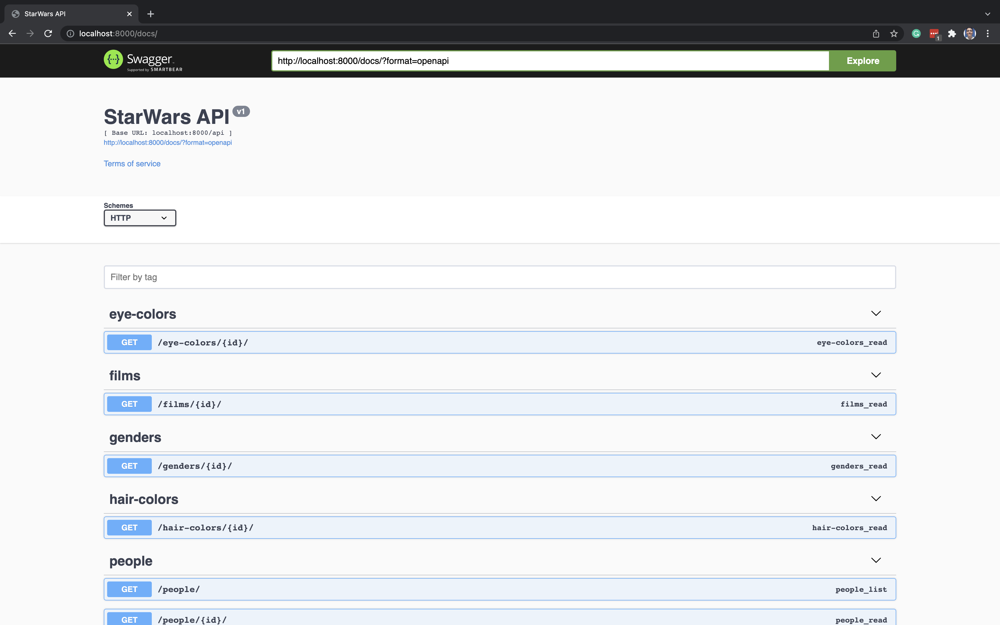
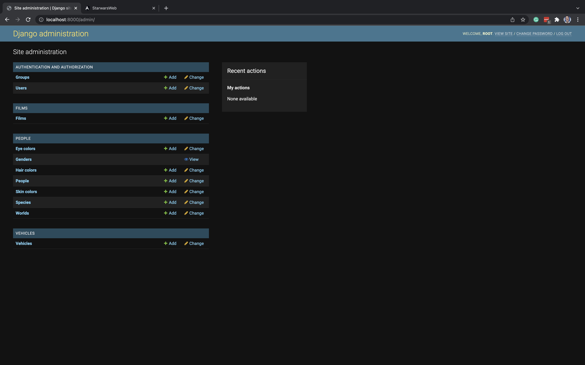
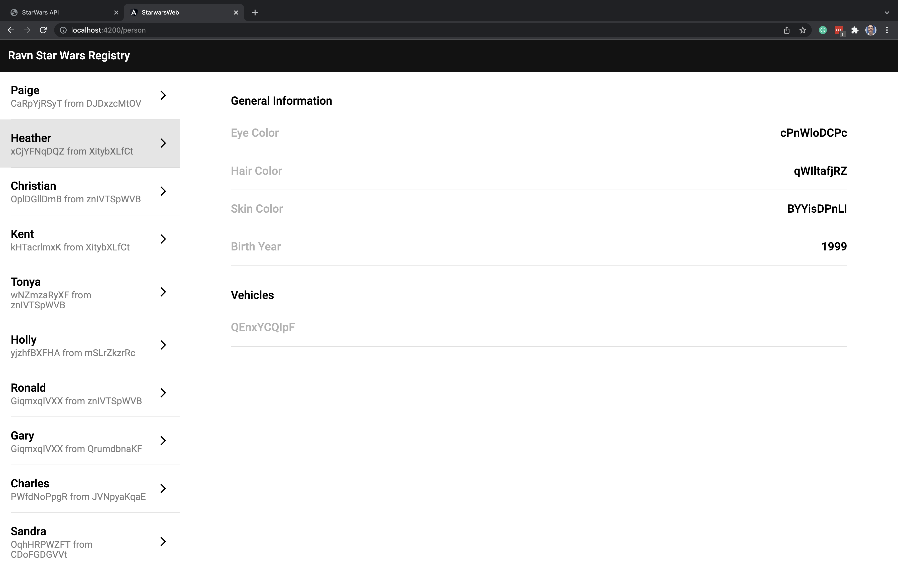

StarWars Challenge | RAVN
=============================

StarWars Challenge consists of a RESTfull API where you can request the paginated character's information, the Django admin where you can save, edit or delete information, and a web client where you can request the characters to the API.

## Technologies
List of technologies used to develop the project:

### Back-End
* Python version: 3.10
* Django version: 4.0

### Front-End
* NodeJS version: 16.14
* Angular version: 13.2







## Preparing the environment

### Preparation to Run Back-End Without Docker
You will need [python](https://www.python.org/downloads/)(>=3.9). To check the installation, open up a terminal and type `python --version` (On a UNIX-like system) or `py --version` (On windows prompt)

After, you need to install [pipenv](https://pipenv.pypa.io/en/latest/install/) to manage the package and the virtual environment ([venv](https://docs.python.org/3/library/venv.html))

Also, you will need to install [postgresql](https://www.postgresql.org/download/)

### Preparation to Run Front-End
You will need to install [node](https://nodejs.org/en/download/). To check the installation, run `node --version` on terminal

## Run Locally

Clone repository
```bash
git clone https://github.com/kevinr1299/Ravn-Challenge-Django-KevinRomero.git
```

Go to the project directory
```bash
cd Ravn-Challenge-Django-KevinRomero
```

### Run Back-End

Go to back-end project
```bash
cd starwars_api
```

#### Run Without Docker
Before the following steps, you might do the [Preparing to run back-end without docker](#preparing-to-run-back-end-without-docker) section.

Create `.env` file
```bash
cp .env.example .env
```

Edit the `.env` file to change SECRET_KEY, DB_NAME, DB_USER, and DB_PASS. If you would like to use `docker-compose`, don't change the DB_HOST attribute. if you have already installed python, you can get a key executing `python gen_key.py`

Install dependencies
```bash
pipenv install
```

Go to the virtual environment
```bash
pipenv shell
```

Run migrations
```bash
python manage.py migrate
```

Run command to collect the static file, this is optional, but if you don't execute, when running the server this can return a warning log
```bash
python manage.py collectstatic --noinput
```

Run seeder command, to execute the command you might change n with an int
```bash
python manage.py seedpeople n
```

Create a superuser to access the Django admin
```bash
python manage.py createsuperuser
```

To run, you can do it with `manage.py`
```bash
python manage.py runserver
```
or with gunicorn
```bash
gunicorn --timeout 50 starwars.wsgi --workers 4
```

#### Run With Docker
Start the containers
```bash
docker-compose up
```

Create the super user
```bash
docker-compose run web python manage.py createsuperuser
```

Default the initialization insert 20 records to add more you can execute the command. You must change the n with an int value.
```bash
docker-compose run web python manage.py seedpeople n
```

### Run Front-End

Go to Front-End project
```bash
cd starwars_web
```

Install dependencies
```bash
npm install
```

Start the server
```bash
npm run start
```

If you change the port of front-end execution, you might stop the execution of the back-end containers and edit the `.env` file on `starwars_api` and edit the ALLOWED_ORIGINS attribute. After you might execute `docker-compose up` again.

## Assumptions
* The birth_date can't be greater than today
* The person has one specie only
* The film select the characters on its creation
* When reloading the page the person selected returns to null


## Alerts
* If you change the DEBUG value on `starwars_api/.env` the documentation and the admin will fail that occurs because Django can't serve the static files, to do this, need to [configure](https://docs.djangoproject.com/en/4.0/howto/static-files/deployment/#serving-the-site-and-your-static-files-from-the-same-server) the webserver like Apache or Nginx to serve the files with the STATIC_ROOT

## Aditional
To run the test, you need to go to starwars_api directory and execute
`pipenv install --dev`, after you can access the venv and run the command.
```bash
pytest --cov
```
To do with docker are these steps:
```bash
docker-compose run web pipenv install --dev --system
docker-compose run web pytest --cov
```
